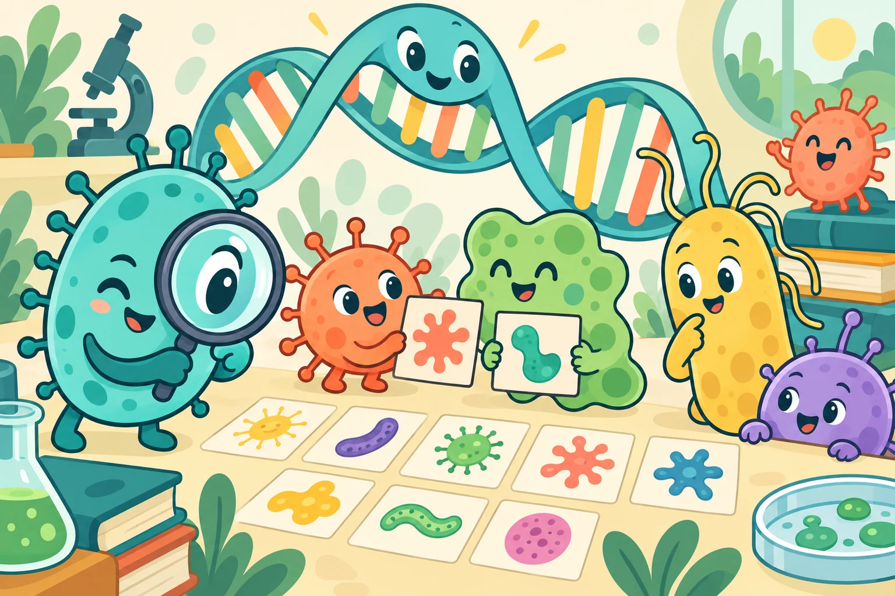

# Begin with curiosity

Education becomes meaningful when a learner can move from “I have heard that word” to “I can explain it, question it and share it.”

Our programme connects children, school students, university peers and community residents. Different audiences need different starting points, so our activities follow four stages: **Explore → Understand → Engage → Connect**.

<figure class="editorial-figure"><figcaption><strong>Discover, compare, ask why</strong>AI-generated educational cartoon. The mascots and DNA character are imaginative teaching devices.</figcaption></figure>

<section class="visual-flow" aria-label="A learner’s path into science">
Visual guide<strong>A learner’s path into science</strong>
<ol class="flow-grid">
<li>
01
<h3>Explore</h3>
Notice something. Ask a question.
</li>
<li>
02
<h3>Understand</h3>
Connect the idea to an explanation.
</li>
<li>
03
<h3>Engage</h3>
Discuss, question and participate.
</li>
<li>
04
<h3>Connect</h3>
Take an idea onward and share it.
</li></ol>
The four stages organise the education programme; full activity records and photographs remain available below.
</section>

## A path into the science

| Stage | Starting point | Formats in our record |
| --- | --- | --- |
| Explore | What can I see, touch or ask? | Child-facing activities, Petri-dish artworks and guided laboratory visits |
| Understand | How does this idea work? | Visual explanations, campus booths and school sessions |
| Engage | What do I think about it? | Questions, quick voting, discussion and feedback |
| Connect | How can I keep learning or share it? | Reusable materials, multilingual leaflets and peer exchange |

<figure><figcaption>Explore: a hands-on entry point into unfamiliar ideas.</figcaption></figure><figure><figcaption>Understand: connect explanations with learners’ questions.</figcaption></figure>

## What the programme records

The county-level programme describes **seven schools and 423 students**. A child-facing activity records **48 pupils**, and the leaflet series covers **15 languages**. These figures refer to different parts of the programme and should not be added into a unique-participant total.

The complete record includes activities at the Medical and Yuzhong campuses, community engagement, school exchanges, academic discussions, material development and evaluation. [Read the full education record →](education-record.md)

## Feedback changed the format

When explanations of recognition and response became confused, the team used a two-stage colour-coded diagram. When early school sessions encouraged attention but little discussion, later sessions added anonymous questions and quick voting. When text-heavy leaflets proved difficult to scan, wording and layout were simplified.

These examples matter more than a claim that an event was “successful”: they show how listening informed the next version of the activity.

## An iDEC extension: define “better”

Our [interactive learning lab](../learn/index.md) invites a learner to change the evaluation goal and observe how a ranking changes. Its values are illustrative, and it is a newly proposed teaching extension. The activity opens a discussion about variation, comparison and trade-offs without requiring a laboratory.

## How we think about impact

**Reach:** Could people access the activity? **Learning:** Could they explain the idea? **Participation:** Could they ask questions and express a view?

Attendance and satisfaction alone do not answer all three. The [full record](education-record.md) retains the programme’s evaluation narrative and limitations.
