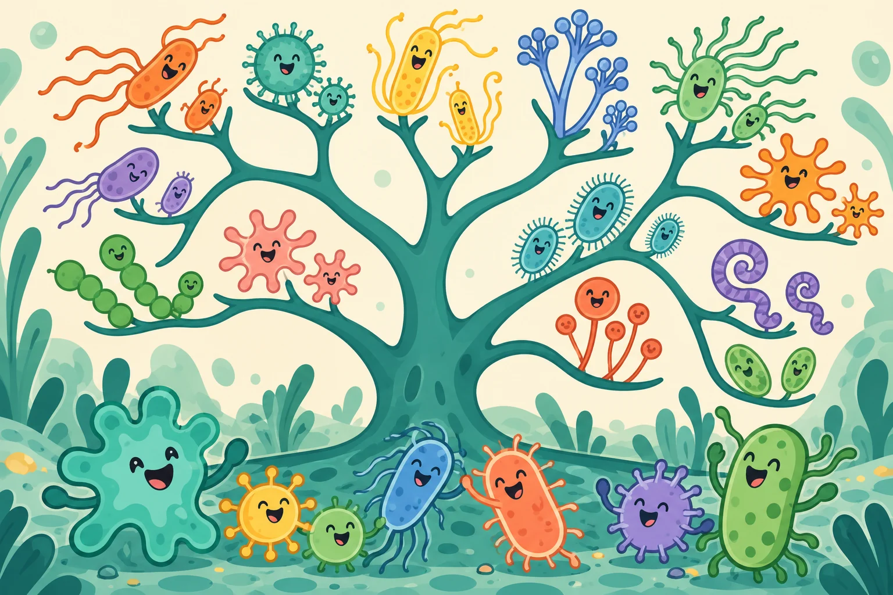

# Who gets to take part?

An explanation, a research question or a future product can exclude people long before anyone notices. Inclusivity begins by looking for those barriers early.

Our work combines stakeholder dialogue, accessible communication and school outreach. Clinical perspectives were gathered through nursing staff, grassroots laboratory professionals and organisational representatives; the inclusivity programme did not directly interview critically ill patients.

<figure class="editorial-figure"><figcaption><strong>Room for many forms of life</strong>AI-generated diversity metaphor, not a reconstructed evolutionary tree or a comparison of human groups.</figcaption></figure>

## Four barriers we learned to ask about

| Barrier | What stakeholders highlighted | Direction for future work |
| --- | --- | --- |
| Physical burden | Complex sample handling may be difficult for frail patients | Consider simpler workflows |
| Equipment access | Large instruments may be unavailable in grassroots settings | Examine practical operating requirements |
| Visual access | A colour-only readout can exclude visually impaired users | Explore complementary non-visual communication |
| Cost and opportunity | Educational and healthcare resources are unevenly accessible | Plan low-cost learning formats and assess affordability |

These are prospective priorities, not validated features of a clinical product.

## Participation inside and outside the team

The source record describes captioned online discussions, shared meeting notes, internal inclusivity training, community booths, workshops and county-level school lectures. [Read the complete practice record →](inclusivity-record.md)

## What the feedback tells us

The programme reports **187 questionnaires distributed and 154 valid responses**. Participants valued accessible explanations and raised requests for more sustained learning and additional accessibility formats. The record notes that physical Braille materials were still pending and that geographic coverage remained limited.

These responses are useful for improving the programme. They are not a controlled estimate of educational effectiveness.

## Resources for the next conversation

Our [resource library](resources.md) provides three downloadable guides: healthcare stakeholder interview protocols, stakeholder-investigation templates and inclusivity guidance for biomedical teams. Each can be adapted to the audience and ethical context of a new project.

For this website, our contribution includes keyboard-operable learning activities, readable text, text alternatives and information that remains available without an animation or image.
