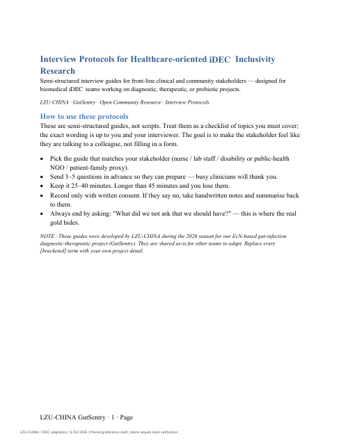
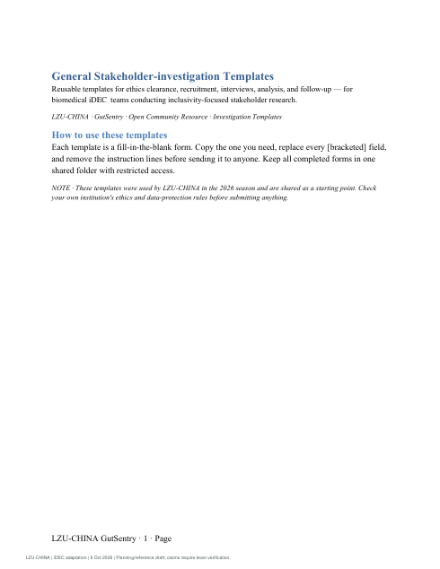
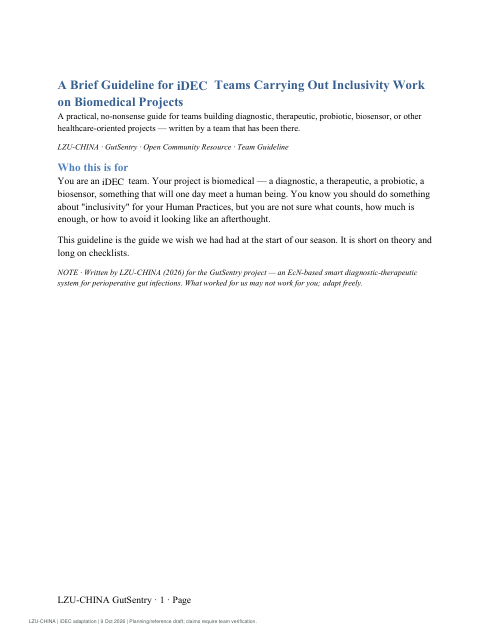

# Who gets to take part?

Language, format, cost and access can all prevent people from taking part. Inclusivity begins by asking who faces these barriers and how we can address them.

Our work combines stakeholder dialogue, accessible communication and school outreach. Clinical perspectives were gathered through nursing staff, grassroots laboratory professionals and organisational representatives; the inclusivity programme did not directly interview critically ill patients.

<figure class="editorial-figure"><figcaption><strong>Room for many forms of life</strong>AI-generated diversity metaphor, not a reconstructed evolutionary tree or a comparison of human groups.</figcaption></figure>

## Four barriers we learned to ask about

| Barrier | What stakeholders highlighted | Direction for future work |
| --- | --- | --- |
| Physical burden | Complex sample handling may be difficult for frail patients | Consider simpler workflows |
| Equipment access | Large instruments may be unavailable in grassroots settings | Examine practical operating requirements |
| Visual access | A colour-only readout can exclude visually impaired users | Explore complementary non-visual communication |
| Cost and opportunity | Educational and healthcare resources are unevenly accessible | Plan low-cost learning formats and assess affordability |

These are prospective priorities, not validated features of a clinical product.

## Participation inside and outside the team

Our programme included captioned online discussions, shared meeting notes, internal inclusivity training, community booths, workshops and county-level school lectures. [Read the complete practice record →](inclusivity-record.md)

## What the feedback tells us

We distributed **187 questionnaires and received 154 valid responses**. Participants valued accessible explanations and raised requests for more sustained learning and additional accessibility formats. Physical Braille materials are still pending, and our geographical coverage remains limited.

These responses are useful for improving the programme. They are not a controlled estimate of educational effectiveness.

## Interview and inclusivity resources

The three guides below provide interview protocols, stakeholder research templates and inclusivity guidance for biomedical teams. Adapt them to your audience and the ethical requirements of your project.

| Resource | Read | Save |
| --- | --- | --- |
| Healthcare stakeholder interview protocols | [Open PDF](../assets/community-source/inclusivity/documents/01-interview-protocols-for-healthcare-inclusivity-1.pdf) | [Download](../assets/community-source/inclusivity/documents/01-interview-protocols-for-healthcare-inclusivity-1.pdf){ download } |
| General stakeholder-investigation templates | [Open PDF](../assets/community-source/inclusivity/documents/02-stakeholder-investigation-templates.pdf) | [Download](../assets/community-source/inclusivity/documents/02-stakeholder-investigation-templates.pdf){ download } |
| Inclusivity guidance for student biomedical research teams | [Open PDF](../assets/community-source/inclusivity/documents/03-guideline-for-biomedical-idec-inclusivity-work.pdf) | [Download](../assets/community-source/inclusivity/documents/03-guideline-for-biomedical-idec-inclusivity-work.pdf){ download } |

If a PDF does not display, use its Open or Download link.
