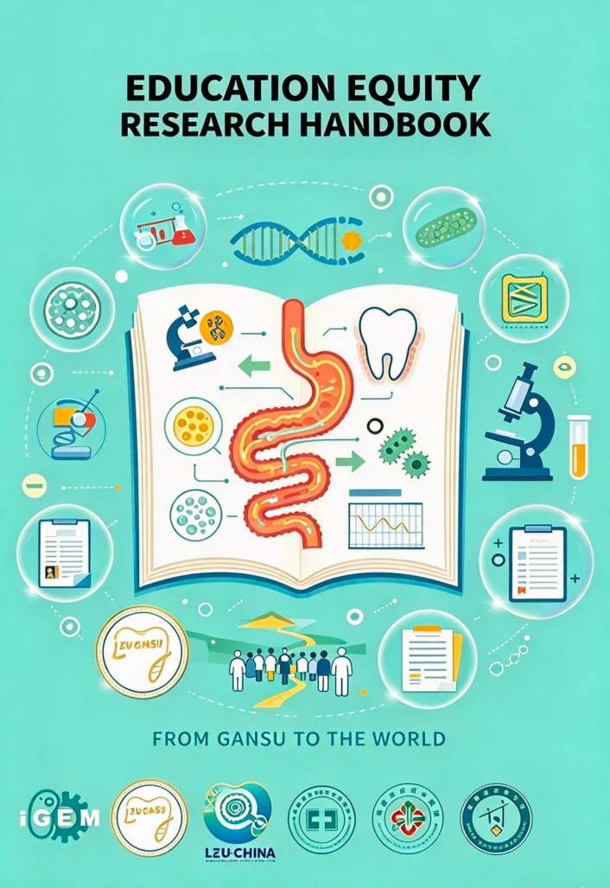
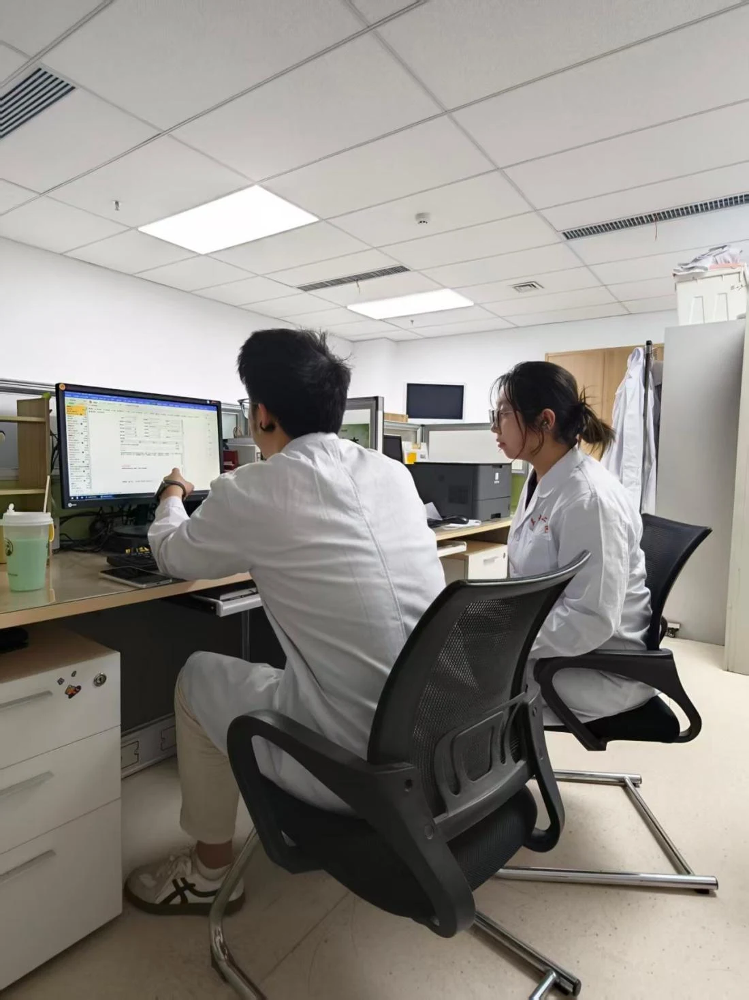
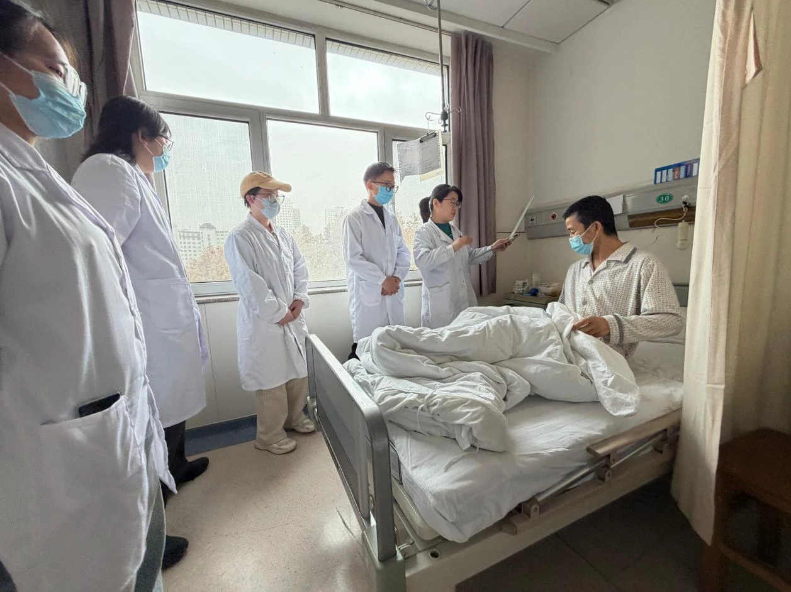
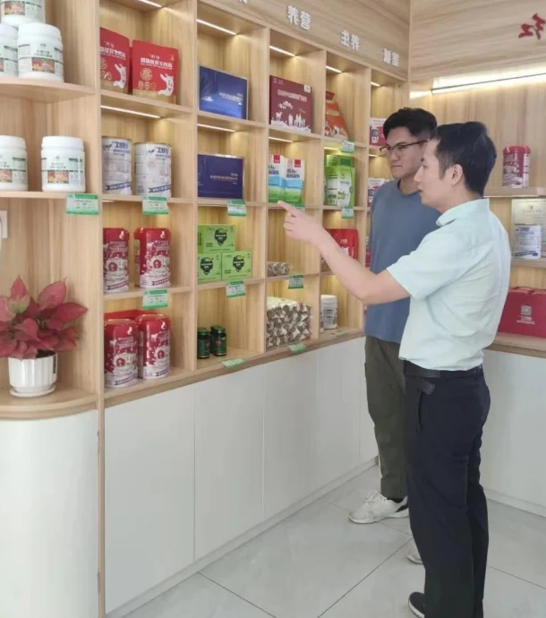
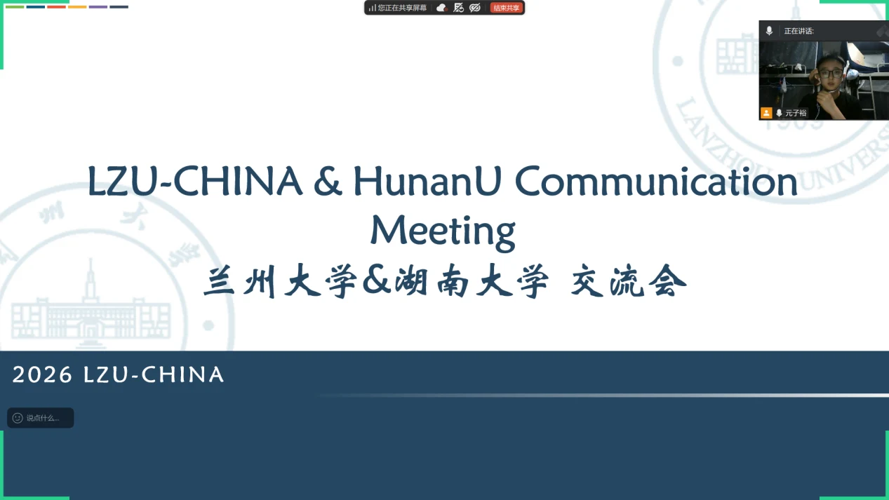
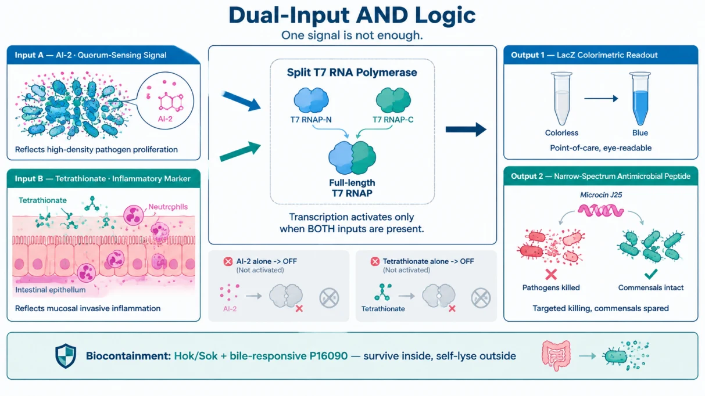
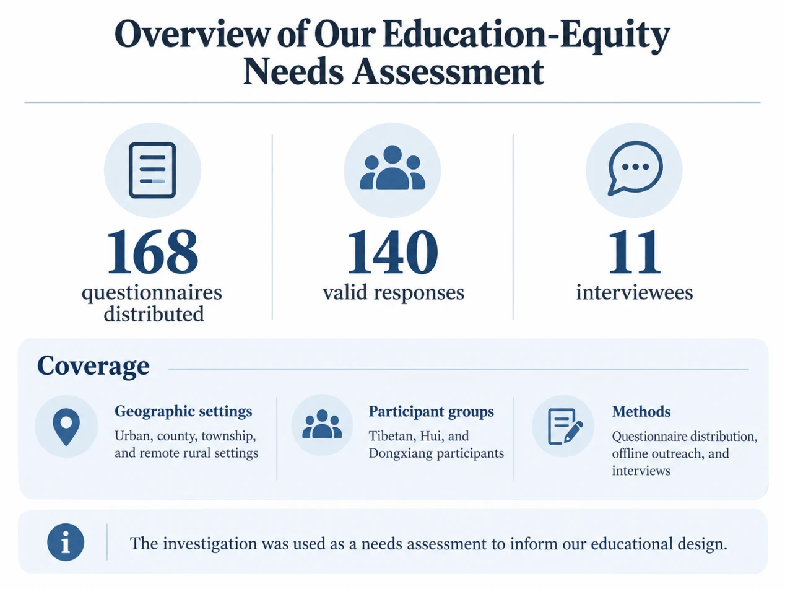
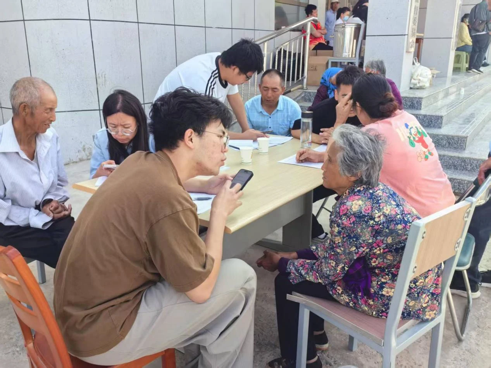
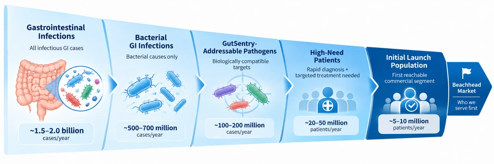

# Integrated Human Practices

Listening shapes the question. Dialogue shapes the design. Shared learning helps the community grow.

<nav class="ihp-topics" aria-label="Community sections"><a aria-current="page" href="./">IHP</a><a href="education/">Education</a><a href="entrepreneurship/">Entrepreneurship</a><a href="inclusivity/">Inclusivity</a><a href="sustainability/">Sustainability</a><a href="collaboration/">Collaboration</a></nav>

## Our contribution to the iDEC community

We see Integrated Human Practices (IHP) as the work of making a research project responsible, understandable, accessible and useful to society. For LZU-CHINA, this means connecting our scientific questions with the people who would learn from, work with or eventually use the technology. Our contribution to the iDEC community brings together education, peer exchange, clinical and industry dialogue, inclusion and sustainability. This page follows how those conversations shaped our priorities across preparation, exploration and responsibility.

### The project at a glance

GutSentry is an engineered Escherichia coli Nissle 1917 (EcN-1917) research concept for sensing and responding to intestinal infection. Its proposed architecture connects in-situ sensing, dual-input logic, a colour-readable output, targeted antimicrobial intervention and programmed containment. The intended split-T7 AND gate combines a pathogen-associated AI-2 signal with tetrathionate, an inflammation-associated signal; a bile-responsive Hok/Sok module is intended to limit survival outside the host. The [system design](../project/design.md) and [experimental results](../project/results.md) describe the current laboratory evidence. Here we focus on how people and practical needs shaped the design objectives.

### Three phases, five dimensions

We organised our Human Practices into three connected phases. Each brings a different perspective into a continuing cycle of listening, discussion, design and review.

Preparation Phase. Defining the problem and building the foundations — literature review, expert and front-line interviews, and fieldwork that turned clinical and social needs into engineering objectives.

<figure class="ihp-figure"><figcaption>Cover of the educational equity survey handbook (prepared by the team)</figcaption></figure>

Exploration Phase. Bringing feedback into design — using dialogue with clinicians, peers and experts to refine priorities, and investigating educational equity.

Responsibility Phase. Sharing what we learn and widening participation across five dimensions: Education, Collaboration, Entrepreneurship, Inclusivity and Sustainability.

Together, these dimensions help us ask how research is understood, who can participate, how teams learn from one another and what responsible development would require.

### Community work at a glance

Our community work includes the following activities and resources. These figures describe different programmes and may include overlapping participants; they are not a combined count of unique people or proof that another iDEC team adopted a resource.

| Area | Activities and resources reported | Purpose for the community |
| --- | --- | --- |
| Educational resources | 15-language trifold series, education toolkit and workshop materials | Support accessible explanations and reusable outreach |
| University exchange | Six university teams and the first APIC Conference | Share technical questions and experience across institutions |
| Education reach | 48 children aged 8–11; about 64 older adults aged 58–82; 423 students across seven schools; two campuses; six Lanzhou subdistricts | Engage different ages and settings |
| Inclusive participation | Four booths: 286 participants; six exchanges: 128 participants and 78 suggestions; five workshops: 164 participants | Bring more perspectives into science communication |
| Education-equity investigation | 168 questionnaires, 140 valid responses and 11 interviews | Understand barriers before designing activities |
| Inclusivity feedback | 187 questionnaires, 154 valid responses | Inform accessibility and communication priorities |
| Healthcare and industry dialogue | First Hospital of Lanzhou University; Gansu Provincial CDC; Jinghong; AWON Shanghai; AWON Shandong | Connect research questions with practical constraints |
| Responsible practice | Consent and anonymisation described in the report; indirect collection of patient-centred needs | Respect participants and consider responsibility from the outset |

## Preparation · Listen and define

### Listening to the front line

We began with literature review, expert interviews and front-line fieldwork. A tertiary-hospital gastroenterologist described two linked barriers: primary-care facilities may lack diagnostic instruments, and waiting two days for stool culture can be impractical. This feedback motivated a nitrocefin-based colour-readable approach, with a target of a result within half a day. Communications with the First Hospital of Lanzhou University sharpened our understanding of the interval between infection onset and definitive diagnosis. Consultations with the Gansu Provincial Center for Disease Control and Prevention broadened the discussion to surveillance, prevention and public acceptance. The target turnaround time guided planning; clinical performance remains a separate validation question.

<figure class="ihp-figure"><figcaption>Team members interviewing clinicians</figcaption></figure>

### Clinical, industry and community engagement

Healthcare. Dialogue with clinicians grounded the diagnostic and therapeutic concepts in ward constraints. ICU geriatric nurses and grassroots laboratory physicians added accessibility, sample handling and workflow concerns.

<figure class="ihp-figure"><figcaption>Team members participating in clinical investigations</figcaption></figure>

Industry. Conversations with Jinghong Health Products Ltd. (Mr. Liu Jinghong), Shanghai AWON Dental Technology and AWON (Shandong) Medical Technology taught us that a complete product requires formulation, presentation, intellectual-property protection and evidence-based communication — not technology alone.

<figure class="ihp-figure"><figcaption>Conducting an industry interview with Mr. Liu Jinghong to discuss product development, intellectual property rights and commercialisation.</figcaption></figure>

Communities. We engaged six Lanzhou subdistricts, hospitals and primary schools to bring biotechnology beyond the campus and hear public concerns about engineered bacteria, disease detection and emerging research.

### Building the collaboration network

Our network connected support within the university, exchanges between teams and engagement beyond campus. We exchanged ideas with six university teams — Hunan University (25 May, dual-input AND gate), Shenyang Pharmaceutical University (25 May, dual-signal selection), Southern Medical University (25 May, clinical translation and safety), Fudan University (26 May, integrated diagnosis–treatment), Shenzhen University (29 May, narrow-spectrum targeted therapy) and Huazhong Agricultural University (13 August, Hok/Sok biocontainment) — and presented at the 1st APIC Conference on Synthetic Biology Innovation and Application, where expert feedback on target specificity and in-vivo colonization informed our validation priorities. Our project was approved as a provincial-level innovation project under the 2026 Gansu Provincial College Students' Innovation Training Programme (No. 2026-12, score 76.93/100).

<figure class="ihp-figure"><figcaption>Inter-university online exchange seminar, recorded by the team.</figcaption></figure>

## Exploration · Bring feedback into design

### Connecting the modules

The proposed architecture links sensing, computation, intervention and containment. The intended dual-input rule aims to distinguish coincident signals from either signal alone. Colour-readable and antimicrobial outputs connect detection with a possible response, while the bile-responsive Hok/Sok design makes containment an early engineering question. Stakeholder feedback helps define the properties to evaluate — specificity, readability, stability and containment — rather than substituting for those evaluations.

<figure class="ihp-figure"><figcaption>Conceptual two-input AND logic and proposed output and containment modules. This schematic describes the design intention; it is not a measurement of biological performance.</figcaption></figure>

### A closed feedback loop

External voices changed the questions we asked, the way we explained the project and our priorities for future development. The table connects those insights with design responses. Accessibility features and in-vivo validation remain development priorities.

| Stakeholder insight | Response in our planning | Question to carry forward |
| --- | --- | --- |
| Primary-care clinicians: cost and delays limit usefulness | Prioritise a nitrocefin-based, visually readable output and a half-day target | Can readability and turnaround be demonstrated in the intended setting? |
| ICU nurses: dim lighting complicates colour interpretation | Consider high-contrast outputs | How reliable is interpretation under realistic lighting? |
| Gansu Red Cross Society: colour-only output can exclude users | Explore complementary non-visual interfaces | Which formats are accessible and acceptable to intended users? |
| Grassroots laboratory professionals: bulky instruments and long workflows | Plan simpler preparation and reduced instrument dependence | What equipment and steps are truly necessary? |
| Huazhong Agricultural University peers: environmental release is a central risk | Include bile-responsive Hok/Sok containment in the design | How will containment be evaluated across conditions? |
| APIC experts: colonisation stability matters before efficacy claims | Prioritise appropriate in-vivo validation in future work | What evidence would establish stability and safety? |
| Jinghong and AWON: a product requires more than a technical idea | Incorporate formulation, quality, intellectual property and communication into the roadmap | What evidence is needed before each development stage? |

### Investigating educational equity

To ensure our education rested on evidence rather than assumption, we conducted an education-equity investigation with LZU-GANSU — 168 questionnaires (140 valid) and 11 interviews with teachers, students and parents, including Tibetan, Hui and Dongxiang communities. 87.14% of respondents perceived a gap in STEM access between urban and rural areas, and 83.57% called for low-cost, adaptable rural STEM courses and experiment kits. These findings helped us prioritise hands-on activities and reusable materials suited to local audiences.

<figure class="ihp-figure"><figcaption>Survey of educational needs and access</figcaption></figure>

## Responsibility · Five dimensions of practice

### Education

Our tiered education programme reached children, secondary-school students, university students, older adults, community residents and county-level youth. Activities included 48 pupils aged 8–11 in the “Micro-World on a Petri Dish” art challenge, about 64 older residents in Jiayuguan Road and Baiyin Road subdistricts, community participants in Weiyuan Road subdistrict, and two university campus audiences. A cross-regional secondary-school network connected Northwest, Central, South and Southwest China; seven rural and county-level schools received lectures reaching 423 students. We developed a 15-language trifold series and an education toolkit intended for reuse. Participant feedback encouraged clearer comparisons between directed evolution and genetic engineering, and separate explanations of signal recognition and biological response. These formats provide starting points for other iDEC educators to adapt. [Explore Education →](education.md)

<figure class="ihp-figure"><figcaption>Communication and interaction with elderly residents in the community</figcaption></figure>

### Collaboration

Inter-university exchange, the APIC Conference, clinical and public-health dialogue, community outreach and institutional support connected different kinds of expertise. The Huazhong Agricultural University discussion reinforced the need to consider containment from the start. Clinicians brought practical needs; peers challenged circuit reasoning and safety assumptions; industry partners raised questions about development and communication. The value of this network lies in sharing questions and learning across disciplines. [Explore Collaboration →](collaboration.md)

### Entrepreneurship

We explored translation through business plans, industry reports, innovation forums, startup competitions and front-line conversations. Industry feedback reinforced product development, intellectual property and evidence-based communication. Our planning covers market analysis, competitive context, SWOT, Porter’s Five Forces and risk mitigation, guided by the vision “Sense Early. Decide Precisely. Act Locally. Stop Safely.” The business plan offers a framework for examining a possible route from laboratory concept to future healthcare use. Its market estimates and forecasts are planning assumptions. [Explore Entrepreneurship and its business plans →](entrepreneurship.md)

<figure class="ihp-figure"><figcaption>Market segmentation funnel from all intestinal infection cases to the first launch population. Levels: intestinal infection → bacterial intestinal infection → GutSentry-addressable pathogens → high-need patients requiring rapid diagnosis and precision intervention → first launch population (beachhead market). Population figures are team estimates, to be calibrated with epidemiological and procurement data.</figcaption></figure>

### Inclusivity

Literature and proxy interviews with ICU geriatric nurses, grassroots laboratory physicians and the Gansu Red Cross Society identified barriers in sample handling, equipment availability, colour-only interpretation and cost. They informed prospective directions: high-contrast outputs, simpler workflows, complementary non-visual interfaces and affordable formats. The programme records four community booths (286 participants), six exchange meetings (128 participants and 78 suggestions), five themed workshops (164 participants), and seven county-level school lectures (423 students). Our outreach record indicates that more than 85% of county-level students were encountering directed evolution for the first time. It also describes audio scripts for visually impaired audiences. Of 187 questionnaires distributed, 154 were valid (82.4%). Interview protocols, investigation templates and an inclusivity guide are available for others to adapt. [Explore Inclusivity and its resources →](inclusivity.md)

### Sustainability

Our sustainability discussion focuses on SDGs 3, 4, 10, 12 and 17, with secondary links to SDGs 8 and 2. Education, accessible participation and partnerships connect directly with the documented community work. For the research concept, reduced reagent use, lower disposable-material burdens, renewable fermentation inputs and containment are questions for future assessment. They require measurement before an environmental benefit can be established. Treating these questions early helps connect responsible development with the long-term trust on which the iDEC community depends. [Explore Sustainability →](sustainability.md)

## Responsible research

Our Human Practices approach includes informed consent and anonymisation for questionnaires, interviews and public engagement. Patient-centred needs were gathered indirectly through professional and organisational representatives; the programme did not directly interview patients. Biosafety also shaped peer discussions and the proposed Hok/Sok containment architecture. The intended containment behaviour still requires experimental assessment under relevant conditions. Our [responsible research page](../responsible-research.md) connects the project with its review and safety responsibilities.

## Building the iDEC community together {#community-summary}

We want to help build an iDEC community in which scientific progress is accompanied by public understanding, open exchange and responsible development. Across three phases and five dimensions, our work connects the laboratory with classrooms, communities, healthcare settings and industry. Each setting brings a different question about what matters, who benefits and what should happen next.

Clinicians grounded our priorities in practical needs. Grassroots practitioners and representatives made accessibility part of the discussion. Peer teams and conference experts challenged assumptions about circuits, containment and evidence. Industry partners broadened our view of how a research idea might become a usable product. Students and residents reminded us that clear explanations and space for questions matter to public trust.

Our continuing commitment is to make this learning useful beyond one competition season: share educational approaches, keep interview and inclusivity resources accessible, and offer our planning framework for others to question and adapt. We hope to help form an open, inclusive and mutually supportive iDEC community, where teams can discuss uncertainty, learn from one another and build on previous work.
