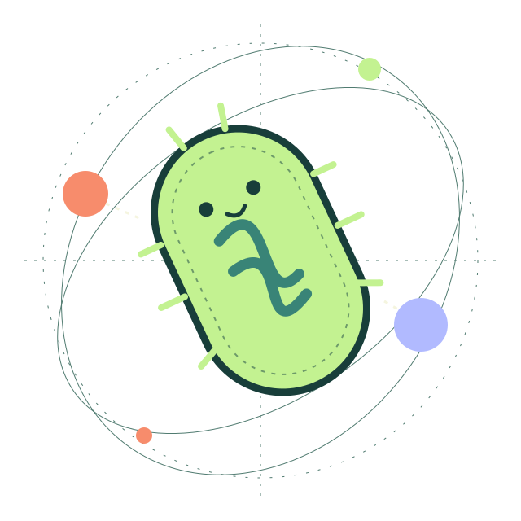
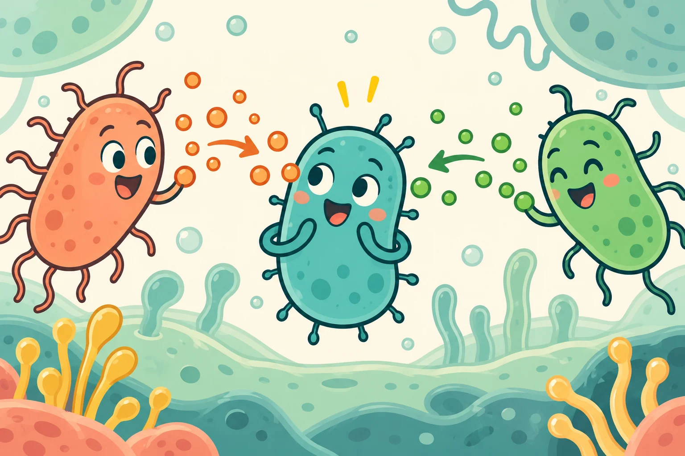

<section class="atlas-hero" aria-labelledby="atlas-title">

LZU-CHINA / iDEC 2026 / GUTSENTRY<h1 id="atlas-title">Follow the <em>signal.</em> Explore what changes.</h1>
A journey through biological signals, the meaning of “better”, and the people who make science matter.

<a class="atlas-button" href="#signal">Start the journey ↓</a><a class="atlas-link" href="atlas/">Find your own path ↗</a>
Research concept · Open questions · Shared learning

01 / SENSE02 / COMPARE03 / LEARN
GUTSENTRY Concept specimen / not microscopy

AN EVOLUTION ATLASScroll to explore / 4 chapters ↓

</section>
<nav class="journey-rail" aria-label="Journey chapters"><a href="#signal" data-chapter-link="signal">01 Signal</a><a href="#selection" data-chapter-link="selection">02 Selection</a><a href="#evidence" data-chapter-link="evidence">03 Evidence</a><a href="#together" data-chapter-link="together">04 Together</a><a href="atlas/" class="rail-map">All paths ↗</a></nav>
<section class="atlas-chapter atlas-signal" id="signal" data-chapter="signal">

01 / A QUESTION OF CONTEXTUnderstand the idea

<h2>A message is only the <em>beginning.</em></h2>
One alarm can be easy to trigger. Two pieces of information can ask a more specific question.

GutSentry explores a two-input biological sensing concept. Start with the intended logic, then look at what the laboratory observations can actually tell us.
<a class="atlas-text-link" href="project/story/">Follow the project story ↗</a>
<figure class="atlas-image"><figcaption>Two inputs, one question. A conceptual cartoon.</figcaption></figure>

<a href="project/background/"><b>01</b><strong>Why this question?</strong>Background and motivation ↗</a><a href="project/design/"><b>02</b><strong>How might it work?</strong>The intended design ↗</a><a href="project/results/"><b>03</b><strong>What was observed?</strong>Results and their limits ↗</a>

</section>
<section class="atlas-chapter atlas-selection" id="selection" data-chapter="selection">

02 / THE EVOLUTION LENSExplore an idea

ABCDBetter <em>for what?</em>
A visual metaphor for comparison

<article data-selection-step="1">01 / VARIATION<h2>Difference opens possibilities.</h2>
There is more than one version to consider. The important question is what differs, and why that difference might matter.
</article>
<article data-selection-step="2">02 / EVALUATION<h2>Your goal changes your choice.</h2>
A fast option need not be the most consistent. Change the weights in our learning lab and see a different option lead.
<a class="atlas-button" href="learn/">Try the interactive lab ↗</a></article>
<article data-selection-step="3">03 / COMPARISON<h2>An improvement needs a reference.</h2>
Conditions, measurements and uncertainty matter. The available project files document engineering, not a complete directed-evolution campaign.
<a class="atlas-text-link" href="project/evolution/">Understand our project scope ↗</a></article>

</section>
<section class="atlas-chapter atlas-evidence" id="evidence" data-chapter="evidence">

03 / OPEN THE RECORDFollow the evidence

<h2>Good questions. <em>Traceable answers.</em></h2>
Choose the depth you need. A clear story should always lead back to its sources.

<a href="project/evidence/">START HERE<strong>The evidence guide</strong>
What is reported, what is proposed, and what remains open.
↗</a><a href="research/">GO DEEPER<strong>The research desk</strong>
Navigate the question, design, observations and limitations.
↗</a><a href="library/">CHECK THE SOURCE<strong>The open library</strong>
Methods, figures, complete activity records and reusable downloads.
↗</a>

</section>
<section class="atlas-chapter atlas-together" id="together" data-chapter="together">

04 / SCIENCE IS A SHARED PRACTICEBuild with us

<figure class="atlas-image"><figcaption>Diversity as a visual metaphor, not a reconstructed phylogeny.</figcaption></figure>
<h2>More perspectives. <em>Better questions.</em></h2>
A student. A nurse. A fellow team. Each brings a question we would not have asked alone.

Explore our recorded exchanges and education work, or take a reusable resource into your own conversation.

<a class="atlas-button" href="community/">Enter the community commons ↗</a><a class="atlas-text-link" href="human-practices/">Follow the activity record ↗</a>

</section>
<section class="atlas-finale">YOUR NEXT QUESTION STARTS HERE<h2>One project. <em>Many ways to explore.</em></h2>
<a class="atlas-button" href="atlas/">Open the complete atlas ↗</a><a class="atlas-link" href="team/">Meet the people ↗</a>
</section>

