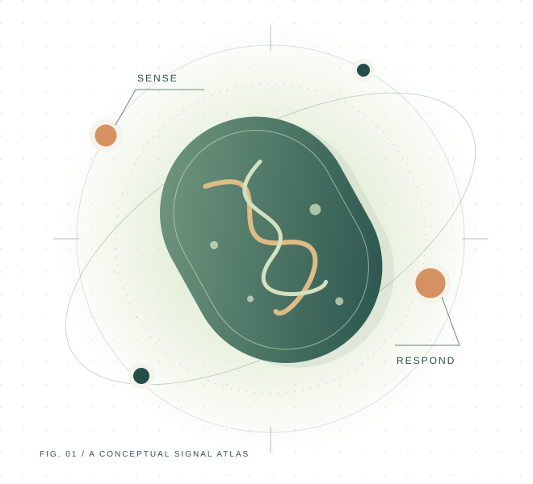

<section class="gs-hero" aria-labelledby="hero-title">

 LZU-CHINA / iDEC 2026

<h1 id="hero-title">Small signals. <em>Meaningful</em> questions.</h1>

A living system is full of messages. GutSentry explores how to read them—and how to make the science understandable, testable and open to more people.

<a class="md-button md-button--primary" href="project/story/">Discover the story ↗</a><a class="md-button" href="learn/">Try the learning lab</a>

An in-vitro research concept. A community learning journey. Evidence, proposals and illustrations are labelled throughout.

<figure><figcaption>GutSentry signal atlas · Conceptual illustration</figcaption></figure>
</section>

A field guide to our project<a href="#three-ways-in">01 / Understand</a><a href="#follow-the-evidence">02 / Investigate</a><a href="#science-with-people">03 / Connect</a>

<section aria-labelledby="three-ways-in">

Choose your starting point<h2 id="three-ways-in">One project. Three ways in.</h2>

You do not need a biology background to begin. Follow the story, explore an idea, or examine the record.

<a class="route-card" href="project/story/">01 / THE CURIOUS VISITOR
<h3>What is a biological signal?</h3>
Start with a simple question: when does a message become useful information?

Read the story ↗</a>
<a class="route-card" href="learn/">02 / THE EXPLORER
<h3>What does “better” mean?</h3>
Change a goal. Compare the outcomes. Discover why improvement needs a definition.

Enter the learning lab ↗</a>
<a class="route-card" href="project/evidence/">03 / THE CRITICAL READER
<h3>What does the evidence say?</h3>
Trace the reported observations to figures, methods and their limits.

Explore the evidence ↗</a>

</section>

<section class="dark-panel" aria-labelledby="signal-question">

The question behind GutSentry<h2 id="signal-question">A message is useful. Its context matters.</h2>
Our research concept combines two gut-associated inputs before producing a visible output. The aim is to ask a more specific question of a complex environment.
<a href="project/story/#two-inputs-one-question">Explore the two-input idea ↗</a>

<b>01</b>
<strong>Sense</strong>Consider more than one input from the environment.

<b>02</b>
<strong>Interpret</strong>Ask what a combination of signals can—and cannot—tell us.

<b>03</b>
<strong>Evaluate</strong>Compare the intended behaviour with the actual observations.

</section>

<section aria-labelledby="follow-the-evidence">

An open research record<h2 id="follow-the-evidence">Curiosity needs evidence.</h2>

Every conclusion has a scope. We make that scope visible so you can judge the story for yourself.

Reported
<strong>Laboratory observations</strong>
Reporter expression, cross-induction, a biofilm assay and a cell-line assay, with the original supplied figures.

<a href="project/results/">Inspect results ↗</a>

Documented
<strong>Engineering and community records</strong>
A retrospective engineering index and detailed outreach, inclusion and collaboration records.

<a href="documentation/notebook/">Follow the record ↗</a>

Open question
<strong>From design to directed evolution</strong>
The available files do not establish a completed evolution campaign. We explain the distinction and the evidence still needed.

<a href="project/evolution/">See the scope ↗</a>

</section>

<section class="community-feature" aria-labelledby="science-with-people">

From Lanzhou, with curiosity<h2 id="science-with-people">Science grows through conversation.</h2>
Children, students, community residents and healthcare professionals asked different questions. Listening to those questions changed the way we communicate science.

<strong>7</strong>schools in the recorded county-level programme

<strong>423</strong>students reached in that programme

<strong>15</strong>languages described in the leaflet series

Figures are reported in the activity records and are not a combined unique-participant total.
<a class="md-button" href="human-practices/">Meet our community work ↗</a>

</section>

Continue the journey<a href="team/">The people</a><a href="human-practices/resources/">Shared resources</a><a href="responsible-research/">Responsible research</a>

