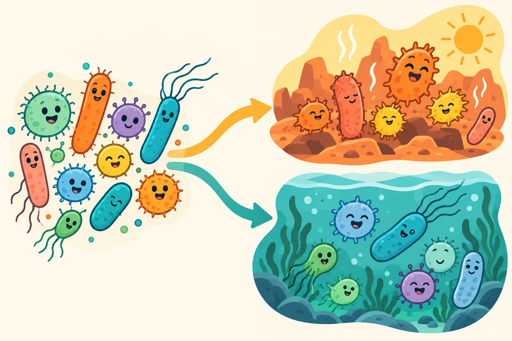

# Better—for which goal?

“Better” sounds like a single destination. In research, it begins with a choice about what matters.

Directed evolution involves variation, selection or screening, and comparison. Different variants can have different properties; the criterion used to evaluate them shapes which ones are carried forward. Our simple exercise below focuses on one part of that reasoning: how a goal changes a ranking.

<figure class="editorial-figure"><figcaption><strong>Different environments, different advantages</strong>AI-generated illustration of variation and environment-dependent selection, not a record of experimental evolution.</figcaption></figure>

## Choose what you value

Imagine four abstract designs that differ in speed and consistency. Their scores are invented for teaching and are not biological measurements. Move the slider to change the importance of each property.

<section class="learning-station" data-tradeoff-station aria-labelledby="trade-title">

Learning station 02 / Illustrative scores only

<h3 id="trade-title">Same options. A different definition of success.</h3>
<label class="weight-control js-only" hidden for="priority-weight">Weight given to speed 50% speed · 50% consistency<input id="priority-weight" type="range" min="0" max="100" step="1" value="50">Prioritise consistencyPrioritise speed</label>

<strong>A</strong>Speed 95Consistency 30Equal-weight score: 62.5

<strong>B</strong>Speed 76Consistency 72Equal-weight score: 74.0

<strong>C</strong>Speed 50Consistency 93Equal-weight score: 71.5

<strong>D</strong>Speed 35Consistency 99Equal-weight score: 67.0

At equal weights, B has the highest illustrative score.

Score = speed × its weight + consistency × the remaining weight. This example illustrates evaluation, not mutation, selection rounds, biological prediction or a completed evolution experiment.

</section>

## What changed—and what did not?

The options stayed the same. Your evaluation changed. A fast option can become less attractive when consistency matters more. In a real project, the criterion should be tied to a meaningful question and justified before interpreting a result.

This is why a single impressive number is not enough. We need to know the baseline, how the measurement was made, the conditions and whether an advantage comes with a trade-off.

<section class="visual-flow" aria-label="The reasoning behind an evolution cycle">
Visual guide<strong>The reasoning behind an evolution cycle</strong>
<ol class="flow-grid">
<li>
01
<h3>Variation</h3>
Begin with versions that differ.
</li>
<li>
02
<h3>Evaluation</h3>
Use a clearly defined criterion.
</li>
<li>
03
<h3>Comparison</h3>
Check against a reference under comparable conditions.
</li>
<li>
04
<h3>Learning</h3>
Use the outcome to inform the next cycle.
</li></ol>
A general learning framework, not a record of a completed evolution campaign by this team.
</section>

## The bigger picture: variation → evaluation → learning

| Idea | In plain language | Question to ask |
| --- | --- | --- |
| Variation | There is more than one version to compare | What differs between the versions? |
| Selection or screening | Versions are evaluated against a criterion | Does the criterion match the intended goal? |
| Comparison | Performance is checked against a reference | Are the conditions and measurements comparable? |
| Learning | The outcome informs what happens next | What did we learn, including an unexpected or negative result? |

Our current work focuses on design and engineering. We have not yet established a completed directed-evolution campaign. The [evolution perspective](../project/evolution.md) explains what would be needed to make that claim.

## A quick reflection

<section class="learning-station" data-quiz aria-labelledby="quiz-title">
<h3 id="quiz-title">Which statement best supports an improvement claim?</h3>

<button type="button" data-correct="false">The new diagram looks more sophisticated.</button><button type="button" data-correct="true">A defined comparison shows an advantage under stated conditions.</button><button type="button" data-correct="false">The largest number must be the best result.</button>

Think about the comparison, the measurement and its conditions. Open the explanation below whenever you are ready.

</section>

??? note "Read the explanation"
    A defined comparison under stated conditions is the strongest of these statements. A visual impression cannot substitute for evidence, and a large number has no meaning without its units, baseline and uncertainty.

## Take this conversation into a classroom

Ask learners to write their definition of “better” before showing the options. Compare choices across the group, then invite them to explain what they would measure. This exercise is intended for future teaching sessions and has not yet been used in our outreach programme.

[Our education programme](../human-practices/education.md) · [Project story](../project/story.md) · [Official directed-evolution learning resources](https://wiki.idec.io/)
