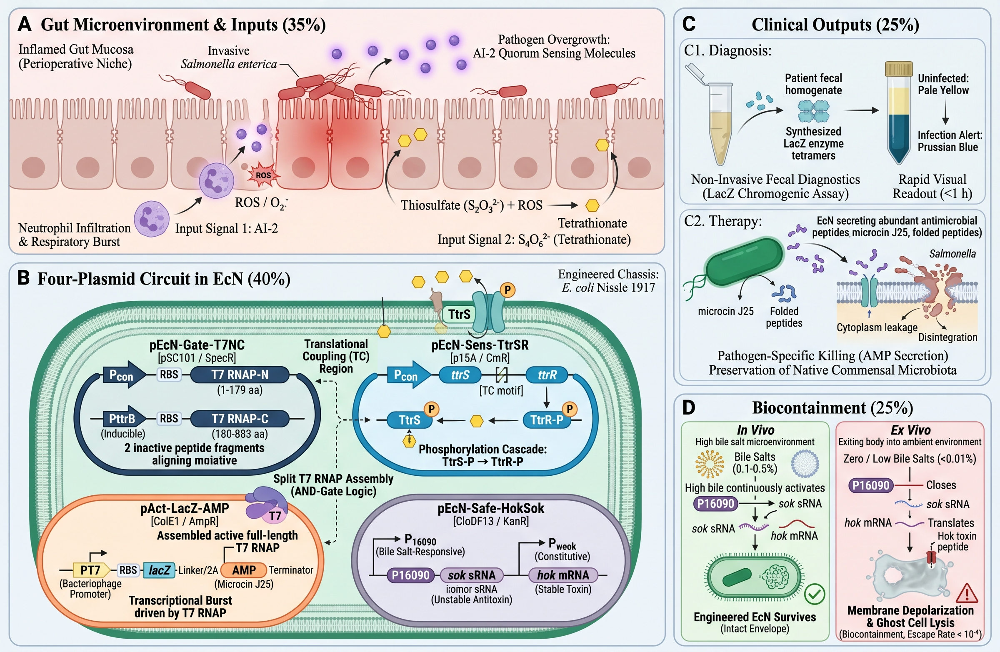

# Background and research question

The context behind the question. Follow the biological rationale, then use the evidence guide to distinguish intention from observation.

## The problem the project explores

Our project addresses intestinal dysbiosis and the expansion of enteric pathogens such as *Salmonella*. We propose an engineered probiotic chassis that could sense two environmental cues and produce a visible reporter signal in a controlled laboratory model. This is a research concept: our experiments do not test patients, clinical samples, or diagnostic accuracy.

{ .wide-figure loading=lazy }

## Why use two inputs?

AI-2 is a bacterial interspecies signaling molecule. Tetrathionate can become available in inflamed intestinal environments and can support *Salmonella* respiration. We hypothesise that combining a quorum-sensing-associated input with tetrathionate could make the output more selective than responding to either cue alone.

The experimental input called “*Salmonella* culture filtrate” is not purified AI-2. It contains AI-2 together with other soluble products of bacterial growth. A direct AI-2 concentration measurement is not available for this assay. We therefore use the term **culture-filtrate proxy** and do not treat the filtrate percentage as an AI-2 concentration.

## Research question

> In an EcN laboratory chassis, does the combination of *Salmonella* culture filtrate and tetrathionate produce a stronger LacZ-associated colorimetric readout than either input alone, and what evidence supports the other proposed system functions?

This question separates our in-vitro measurements from the wider clinical motivation. The available evidence covers tetrathionate tolerance and reporter expression, a cross-induction matrix, a crystal-violet biofilm assay, and an L-929 cell assay. It does not establish diagnostic sensitivity in stool, pathogen-specific treatment, safety in a host, or reliable containment after environmental release.

## Why this belongs in an evolution competition

We organised our engineering work into eleven DBTL cycles. These cover design and testing rather than completed directed-evolution rounds. Our current research record does not establish a mutagenesis or diversified library, selection criterion, genotype–phenotype lineage, or ancestor-versus-improved comparison. See the [Evolution perspective](evolution.md) for the evidence needed to describe an evolution result.

## References

Our scientific rationale draws on studies of inflammation and tetrathionate in the gut, AI-2 signaling, synthetic split-T7 logic, and engineered live biotherapeutics. The reference list is collected in [Data and references](../resources.md).
