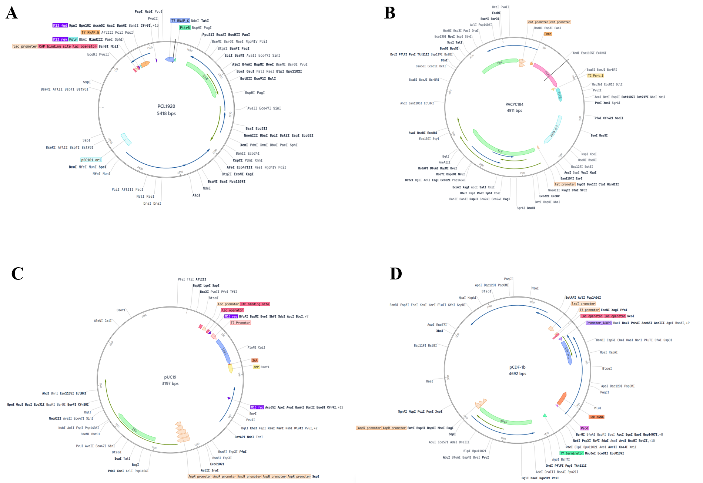
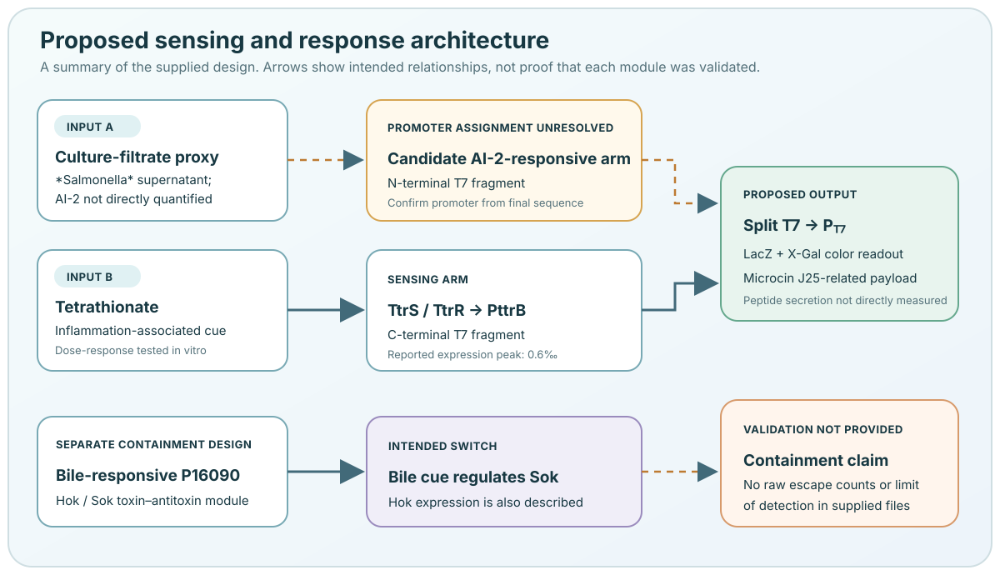

# System design

Read this as a map of the intended system. A proposed module is not automatically an experimentally demonstrated function.

## Proposed signal-to-output path

Our design uses an EcN chassis with four plasmids. The intended design links two inputs to split T7 RNA polymerase, then uses T7-dependent expression for a colorimetric reporter and a proposed antimicrobial payload. A separate bile-responsive Hok/Sok module is intended to provide containment.

{ .wide-figure loading=lazy }

{ .wide-figure }

## System modules

| Module | Components | Intended role | Evidence boundary |
| --- | --- | --- | --- |
| Tetrathionate sensing | TtrS/TtrR and PttrB | Drive a tetrathionate-responsive transcriptional output | Tetrathionate-associated expression is shown in Fig. 3 using a human β-actin reporter substitution. |
| Quorum-sensing-associated input | Proposed AI-2-responsive element; *Salmonella* culture filtrate as the assay input | Supply the second input to the proposed logic gate | A purified AI-2 dose-response and final sequence confirmation of the promoter assignment remain unavailable. |
| Split-T7 and reporter | T7 RNA polymerase fragments and PT7-lacZ | Reconstitute transcription and produce a colorimetric readout with X-Gal | The cross-induction heatmap is shown in Fig. 4A; total induction and substrate-development time were 12 h plus 2 h. |
| Antimicrobial payload | Microcin J25-related sequence and secretion/2A elements | Proposed targeted intervention against *Salmonella* | Our assays do not directly measure mature peptide, secretion, or peptide-specific killing. |
| Containment | Bile-responsive P16090-sok and constitutive/weak hok transcription | Proposed bile-dependent survival switch | Containment figures, raw counts, detection limits and escape-assay records are not yet available. |

## Plasmid architecture

Our plasmid architecture is summarised below. Full sequences, accession identifiers and chromatograms are not yet available in our public data record, so independent verification of construct identity and junctions remains pending.

| Plasmid | Components |
| --- | --- |
| `pCL1920-Pcon-T7_N::PttrB-T7_C` | Two split-T7 fragments; the construct annotation assigns Pcon to the N-terminal fragment and PttrB to the C-terminal fragment. |
| `pACYC184-Pcon-ttrS-(TC)-ttrR` | Tetrathionate-associated two-component sensor and a translational-coupling element. |
| `pUC19-PT7-lacZ-2A-AMP` | T7 promoter, `lacZ`, and a proposed Microcin J25-related payload with a 2A/secretion design. |
| `pCDF-P16090-sok::Psod-hok` | Bile-responsive antisense `sok` and `hok` toxin transcript. |

## What the model does and does not show

The diagram is a map of the **intended design**. It is not a quantitative simulation, clinical workflow, or proof that all four plasmids function together in every assay. A color response in the cross-induction experiment supports the assay outcome, but the available construct records limit mechanistic attribution. Likewise, a crystal-violet change does not identify which payload caused the change, and the containment design is not evidence of zero escape.
