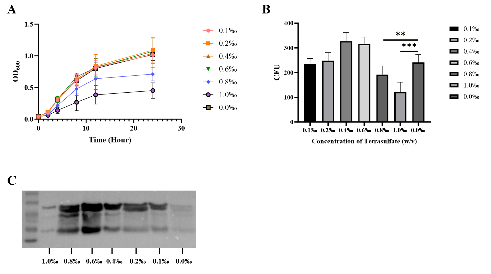
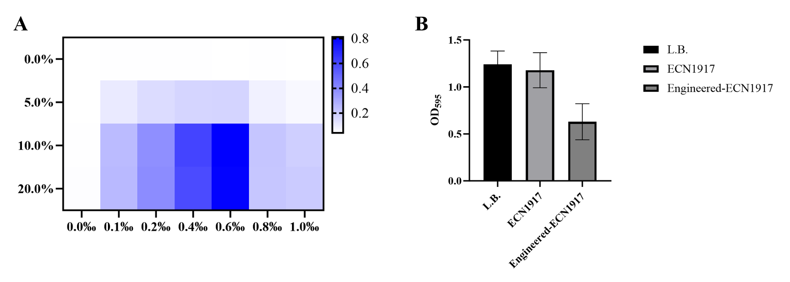
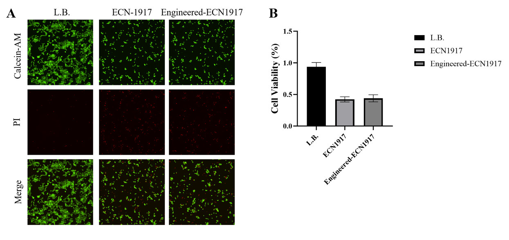

# Experimental results

Four assay perspectives, one limited proof-of-concept. Each observation is paired with its figure and the boundary of the conclusion.

The results below are transcribed from the supplied manuscript and Engineering document. The original figures are retained. Numeric summaries are identified as manuscript-reported values; raw replicate measurements and analysis workbooks were not supplied.

## 1. Tetrathionate tolerance and reporter expression

The manuscript reports growth and plate-count measurements across 0.0–1.0‰ tetrathionate. Growth was similar through 0.6‰, while 0.8‰ and 1.0‰ were associated with lower growth and colony counts. A Western blot using human β-actin as a **substitute reporter** downstream of PttrB is described as strongest at 0.6‰. β-actin here is an inducible readout, not a bacterial housekeeping normalization control.

{ .wide-figure }

**Interpretation:** the supplied figure and text identify 0.6‰ as the reported expression peak and show reduced growth at the higher tested concentrations. The text uses “0.6%” once where the figure and methods indicate “0.6‰”; this page follows the figure and methods. The figure’s CFU axis does not provide enough information to convert the bars to CFU/mL.

## 2. Cross-induction with culture filtrate and tetrathionate

The manuscript reports that the strongest colorimetric signal occurred with 0.6‰ tetrathionate and 10% *Salmonella* culture filtrate. It reports no signal in the tetrathionate-free condition. The heatmap also depicts a blank zero-filtrate row. Because the filtrate is a mixture of soluble culture products, this is a response to the **filtrate proxy**, not a direct measurement of AI-2 concentration.

{ .wide-figure }

The methods list seven tetrathionate levels and four filtrate levels, which make 28 combinations; the text says 21 groups. The plotted heatmap appears to show the 7-by-4 matrix. The actual number of wells and analyzed conditions should be checked against the lab record before final reporting. The methods describe 12 h of co-culture followed by 2 h with X-Gal, so the supplied evidence does not support the separate “visible within one hour” claim in the introduction.

## 3. Crystal-violet biofilm assay

After a pre-formed *Salmonella* biofilm was exposed to LB medium, EcN, or engineered EcN, the manuscript reports OD595 values of **1.25 ± 0.13**, **1.18 ± 0.18**, and **0.62 ± 0.19**, respectively. This assay measures retained crystal-violet-stained biomass. It does not by itself measure viable pathogen counts, prove biofilm eradication, establish an in-host effect, or attribute the change specifically to Microcin J25.

## 4. L-929 cell assay

The manuscript reports relative viability values of **42.6 ± 4.1%** for the EcN chassis and **44.5 ± 5.2%** for engineered EcN, with no statistically significant difference between those bacterial groups. The medium-only group is higher in Fig. 5. A non-significant difference does not establish equivalence or safety; the low values relative to the medium-only group are a reason for caution and further controlled study.

{ .wide-figure }

## 5. Containment claim

The design and Engineering text describe a bile-responsive Hok/Sok switch and report a greater-than-99.99% decline after bile removal. The supplied manuscript includes no containment result figure, raw counts, starting denominator, detection limit, replicate record, or escape assay. The number is therefore not presented here as independently verified evidence of containment or zero escape.

## Overall interpretation

The supplied material supports a limited in-vitro proof-of-concept: tetrathionate-associated reporter expression, a reported cross-induction signal with a *Salmonella* culture-filtrate proxy, lower crystal-violet-stained biofilm biomass in one assay, and no reported significant difference between the two bacterial groups in the L-929 assay. The records do not establish rapid clinical diagnosis, pathogen-specific killing, protection of the native microbiome, host safety, or environmental containment.
